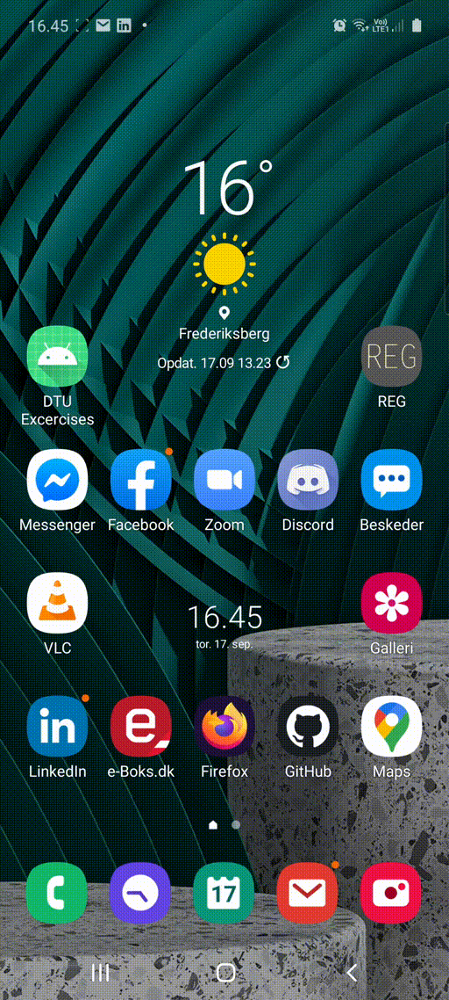

# App til login med http requests.



## Registering

+ Hele funtionen **register** foregår i en **coroutine**, dette er nødvendigt for at lave HTTP requests på android, Der bliver lavet en http request som henter en csv fra et google sheet og der efter bliver der kørt noget Kotlin/Regex magic for at isolere alle studienumre fra listen.
+ Når en bruger skriver sit studienummer bliver det valideret og hvis validation er godkendt vil **postData** funktionen blive kaldt.
+ Til sidst vil man åbne en ny coroutine **launch(Dispatchers.Main)** som giver forbindelse til MainFlowet hvor man har tilladelse til at sende beskeder(Toasts) til useren. 

```kotlin
private fun register(studentId: String) {
    GlobalScope.launch(Dispatchers.IO) {
        val url = "https://docs.google.com/spreadsheets/d/10UT4S48U9TMZTW3--dWaxZM34fF8Vfhw1Q-gP-A8XKI/export?format=csv&id=10UT4S48U9TMZTW3--dWaxZM34fF8Vfhw1Q-gP-A8XKI&gid=730350562"
        val csv = URL(url).readText().split("\n")
        val kode = csv[0].split(",")[1]
        val regex = """s\d{6}""".toRegex()
        var response = ""
        if (regex.matches(studentId)){
            for (line in csv){
                val student = line.split(",")
                if (student.size > 2) {
                    if (regex.matches(student[2])){
                        if (student[2]==studentId){
                            response = postData(studentId, kode)
                            launch(Dispatchers.Main){
                                Toast.makeText(this@MainActivity,validateRespose(response), Toast.LENGTH_SHORT).show()
                            }
                            return@launch
                        }
                    }
                }
            }
            launch(Dispatchers.Main){
                Toast.makeText(this@MainActivity,"Student nummer findes ikke på listen...", Toast.LENGTH_SHORT).show()
            }
        } else {
            launch(Dispatchers.Main){
                Toast.makeText(this@MainActivity,"Du har ikke skrevet et student nummer...", Toast.LENGTH_SHORT).show()
            }
        }
    }
}
```

## Post data

+ Url for script bliver åbnet i en coroutine i registrerings funktionen og har derfor ikke brug for at åbne en op selv
+ Post metoder er en del mere komplicerede end get I kotlin (med URL), men når de er sat op så er det ikke så slemt.
+ Først åbnes forbindelsem og så sættes de forskellige indstillinger, 
+ Så loader man data/payload, og evt. headers.
+ Til sidst sendet requesten afsted og svaret modtages som bytes som man kan appende og decode til en string.

```kotlin
private fun postData(studentId: String, kode: String): String {
    val url = "https://script.google.com/macros/s/AKfycbwBDFeKurY7fDBQ9booRQGo_QyIHl_gEnR0UYKNCb_xGCtPftHu/callback?nocache_id=5"
    val req = URL(url)
    val con = req.openConnection() as HttpURLConnection
    con.requestMethod = "POST"
    con.connectTimeout = 300000
    con.doOutput = true
    val data = ("request=%5B%22submit%22%2C%22%5B%7B%5C%22sno%5C%22%3A%5C%22$studentId%5C%22%2C%5C%22regcode%5C%22%3A%5C%22$kode%5C%22%7D%5D%22%2Cnull%2C%5B0%5D%2Cnull%2Cnull%2Ctrue%2C0%5D").toByteArray()
    con.setRequestProperty("User-Agent", "Your-Mom")
    con.setRequestProperty("X-Same-Domain", "1")
    con.setRequestProperty("Content-Type", "application/x-www-form-urlencoded;charset=utf-8")
    con.setRequestProperty("Referer", "https://script.google.com/macros/s/AKfycbwBDFeKurY7fDBQ9booRQGo_QyIHl_gEnR0UYKNCb_xGCtPftHu/exec?regCodeCell=B1&dateRange=H3:3&studentRange=c4:c&sp=https://docs.google.com/spreadsheets/d/10UT4S48U9TMZTW3--dWaxZM34fF8Vfhw1Q-gP-A8XKI/edit")

    val request = DataOutputStream(con.outputStream)
    request.write(data)
    request.flush()
    con.inputStream.bufferedReader().use {
        val response = StringBuffer()
        var inputLine = it.readLine()
        while (inputLine != null) {
            response.append(inputLine)
            inputLine = it.readLine()
        }
        return response.toString()
    }
}
```

## Validering af svar:

+ Fordi at svaret kommer som en hel html side hver gang, så bruges der Regex til at lede efter det korekte response.

```kotlin

private fun validateRespose(response: String): String {
    return when {
        "Du er allerede registreret" in response -> {
            "Du er allerede registeret"
        }
        "Der skete en fejl" in response -> {
            "Der skete en fejl, det er ikke min skyld. #CheckYourself"
        }
        "Forkert registreringskode" in response -> {
            "Jeg får åbenbart en forkert registreringskode, Dette er min egen skyld..."
        }
        "Registreringssystemet er lukket" in response -> {
            "Registreringssystemet er lukket!"
        }
        else -> "Du er vist nok registeret nu!"
    }
}

```
